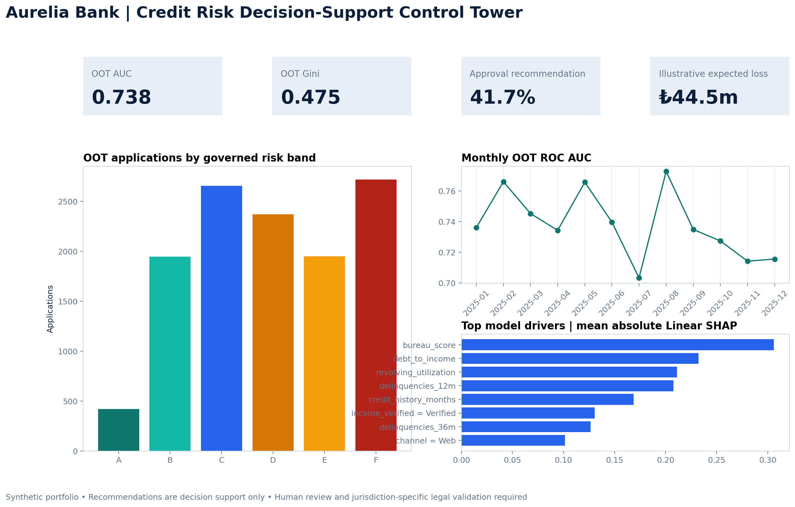
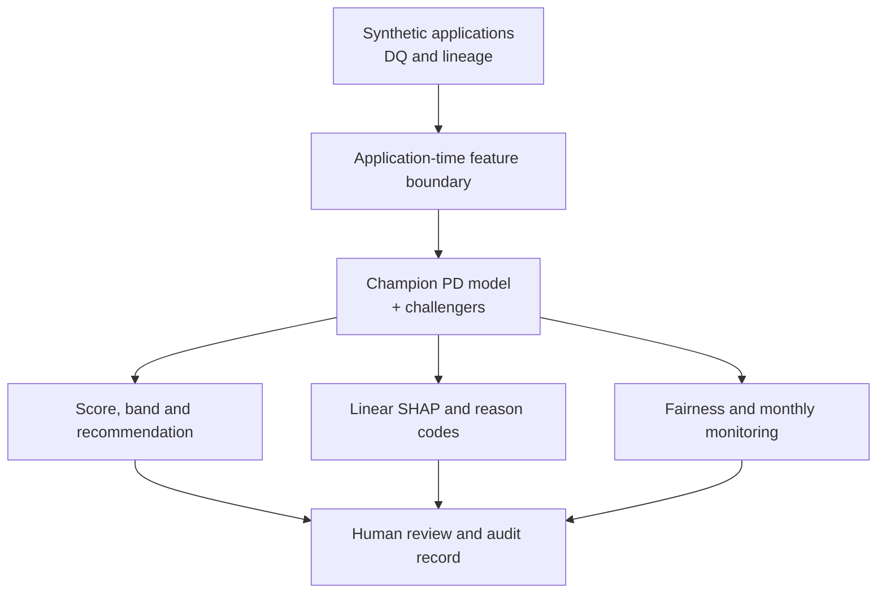

# Banking Credit Risk & Explainable Loan Decisioning Platform

[](https://github.com/muratmiracg-dev/Banking-Credit-Risk-Explainable-Loan-Decisioning-Platform/actions/workflows/ci.yml)
[](https://github.com/muratmiracg-dev/Banking-Credit-Risk-Explainable-Loan-Decisioning-Platform/actions/workflows/codeql.yml)
[](https://github.com/muratmiracg-dev/Banking-Credit-Risk-Explainable-Loan-Decisioning-Platform/actions/workflows/security.yml)
[](https://www.python.org/)
[](LICENSE)

[Türkçe README](README.tr.md)

A portfolio-grade, end-to-end retail credit risk decision-support system for a fictional
institution, **Aurelia Bank**. The project estimates 12-month probability of default (PD),
maps PD to a credit score and A-F risk bands, produces human-review recommendations,
generates exact additive Linear SHAP reason codes, audits allocation and performance by
protected group, and monitors model drift over time.

> [!CAUTION]
> Every record is synthetic. This system is not approved for real lending, pricing, limit
> assignment or adverse-action notices. It returns recommendations only; authorized human
> review and jurisdiction-specific legal, risk and validation approval are mandatory.



## Verified analytical result

The deterministic pipeline generates **48,000 synthetic applications** across 2022-2025
and uses a strict temporal split.

| Evidence | Result |
|---|---:|
| Development / validation / OOT applications | 29,901 / 6,034 / 12,065 |
| OOT ROC AUC | **0.738** |
| OOT Gini | **0.475** |
| OOT PR AUC | **0.421** |
| OOT KS | **0.361** |
| OOT Brier score | **0.134** |
| OOT calibration slope | **0.981** |
| Approval recommendation rate | **41.7%** |
| Approved-group observed default rate | **7.9%** |
| Maximum monthly score PSI | **0.017** |
| Maximum Linear SHAP additivity error | **2.66e-15** |

The fairness audit deliberately exposes a material issue: the gender demographic-parity
difference is **1.6 percentage points**, while the age-band difference is **36.7 percentage
points**. The latter is recorded as `GOVERNANCE_REVIEW_REQUIRED`; the project does not hide
or relabel this signal as acceptable.

## What is implemented

- **Synthetic portfolio engineering:** deterministic generation, canonical SHA-256 evidence,
  schema checks and application-time feature controls.
- **Credit model development:** logistic-regression champion plus histogram gradient boosting
  and random-forest challengers.
- **Temporal validation:** development through June 2024, validation in 2024-H2 and a 2025
  out-of-time test.
- **Credit risk analytics:** ROC AUC, Gini, PR AUC, KS, Brier, log loss, calibration parameters,
  threshold diagnostics and risk deciles.
- **Transparent decision policy:** PD-to-score mapping, A-F risk bands, approve / refer /
  decline recommendations and illustrative `PD × LGD × EAD`.
- **Explainability:** exact interventional Linear SHAP in log-odds, global driver importance,
  local reviewer reason codes and a numerical additivity control.
- **Responsible AI controls:** protected-feature exclusion, disaggregated performance,
  demographic-parity and equal-opportunity diagnostics, and explicit escalation.
- **Model monitoring:** monthly performance, score PSI, feature PSI, approval allocation and
  green / amber / red triage.
- **Operational API:** strict Pydantic request contract, recommendation-only FastAPI service,
  API-key option, health/readiness and Prometheus metrics.
- **Decision intelligence:** PostgreSQL schema/views, Power BI Project starter, a formula-driven
  14-sheet Excel workbench, a 20-slide executive deck and a 16-page governance report.
- **Delivery controls:** tests, 90% coverage gate, Ruff, reproducibility check, CodeQL,
  pip-audit, Trivy and Dependabot.

## System architecture



Protected attributes are stored only in a restricted analytical slice for fairness review.
They do not enter model training, online scoring or reason-code generation.

## Repository map

```text
.
├── src/credit_risk/          # Data, modeling, policy, SHAP, fairness, monitoring and API
├── config/                   # Governed model, policy and monitoring assumptions
├── artifacts/                # Reproducible model, metrics, data, explanations and plots
├── tests/                    # Unit and integration evidence
├── sql/                      # PostgreSQL operational and governance schemas
├── powerbi/                  # PBIP semantic-model starter and banking theme
├── reports/
│   ├── workbook/             # Formula-driven Excel decision workbench
│   ├── presentation/         # 20-slide executive deck
│   └── pdf/                  # 16-page model governance report
├── observability/            # Prometheus, alert rules and Grafana provisioning
├── infra/kubernetes/         # Hardened API deployment reference
├── docs/                     # Architecture, governance, operations and portfolio material
└── .github/                  # CI, CodeQL, security scans, Dependabot and CODEOWNERS
```

## Quick start

### Local analytics

```bash
python -m venv .venv
source .venv/bin/activate
python -m pip install -e ".[dev,reporting]"
python scripts/run_pipeline.py
pytest
```

The pipeline regenerates the portfolio, champion model, validation evidence, SHAP artifacts,
fairness audit, monthly monitoring and analytical plots.

### Recommendation API

```bash
export CREDIT_RISK_ROOT="$PWD"
export CREDIT_RISK_API_KEY="replace-with-a-long-random-value"
uvicorn credit_risk.api:app --app-dir src --host 0.0.0.0 --port 8000
```

```bash
curl --request POST http://localhost:8000/api/v1/score \
  --header "Content-Type: application/json" \
  --header "X-API-Key: ${CREDIT_RISK_API_KEY}" \
  --data @docs/resources/example_score_request.json
```

The response includes PD, score, risk band, recommendation, human-review flag,
illustrative expected loss and four model reason codes. It never executes a final decision.

### Full local stack

```bash
cp .env.example .env
# Replace every placeholder secret in .env.
docker compose up --build
```

| Service | URL |
|---|---|
| API / OpenAPI | `http://localhost:8000/docs` |
| Prometheus | `http://localhost:9090` |
| Grafana | `http://localhost:3000` |

## Decision and explanation contract

| PD interval | Recommendation | Human review |
|---|---|---|
| `< 10%` | `APPROVE_RECOMMENDATION` | Policy-dependent confirmation |
| `10% to < 22%` | `REFER` | Mandatory |
| `>= 22%` | `DECLINE_RECOMMENDATION` | Mandatory plus disclosure workflow |

The score is anchored at 650 points for 10% PD with 50 points to double the odds. Linear
SHAP contributions are model evidence in log-odds, not causal explanations. See the
[explainability standard](docs/governance/explainability-standard.md) and
[decision policy](docs/governance/decision-policy.md).

## Professional deliverables

| Deliverable | Path |
|---|---|
| Formula-driven decision workbench | [`reports/workbook/credit_risk_decision_workbench.xlsx`](reports/workbook/credit_risk_decision_workbench.xlsx) |
| 20-slide executive deck | [`reports/presentation/credit_risk_executive_deck.pptx`](reports/presentation/credit_risk_executive_deck.pptx) |
| 16-page model governance report | [`reports/pdf/credit_risk_model_governance_report.pdf`](reports/pdf/credit_risk_model_governance_report.pdf) |
| Power BI Project starter | [`powerbi/CreditRiskDashboard.pbip`](powerbi/CreditRiskDashboard.pbip) |
| Model card | [`docs/governance/model-card.md`](docs/governance/model-card.md) |
| Validation report | [`docs/governance/model-validation-report.md`](docs/governance/model-validation-report.md) |
| Fairness assessment | [`docs/governance/fairness-assessment.md`](docs/governance/fairness-assessment.md) |
| Monitoring runbook | [`docs/operations/monitoring-runbook.md`](docs/operations/monitoring-runbook.md) |
| LinkedIn and portfolio copy | [`docs/portfolio/PROJECT_DESCRIPTION.md`](docs/portfolio/PROJECT_DESCRIPTION.md) |

## Reference framework

The governance design is informed by primary sources; it does **not** claim conformity or
compliance:

- [Basel Committee - Principles for the management of credit risk (2025)](https://www.bis.org/bcbs/publ/d595.pdf)
- [EBA - Guidelines on loan origination and monitoring](https://www.eba.europa.eu/sites/default/files/document_library/Publications/Guidelines/2020/Guidelines%20on%20loan%20origination%20and%20monitoring/884283/EBA%20GL%202020%2006%20Final%20Report%20on%20GL%20on%20loan%20origination%20and%20monitoring.pdf)
- [Regulation (EU) 2024/1689 - AI Act](https://eur-lex.europa.eu/eli/reg/2024/1689/oj)
- [NIST AI Risk Management Framework](https://www.nist.gov/itl/ai-risk-management-framework)
- [IFRS 9 Financial Instruments](https://www.ifrs.org/issued-standards/list-of-standards/ifrs-9-financial-instruments/)
- [SHAP documentation](https://shap.readthedocs.io/en/latest/)
- [scikit-learn probability calibration](https://scikit-learn.org/stable/modules/calibration.html)
- [Fairlearn assessment documentation](https://fairlearn.org/main/user_guide/assessment/index.html)

## Reproducibility and verification

```bash
make pipeline
make lint
make test
python scripts/verify_artifacts.py
```

The canonical synthetic-data SHA-256 is:

```text
a47bf52861e50cb2fd83f48dcf53d53361fccaadfbcf2dbb186af5826aa44799
```

## License

Code is released under the [MIT License](LICENSE). Generated data and documentation are
provided for demonstration and education only.
