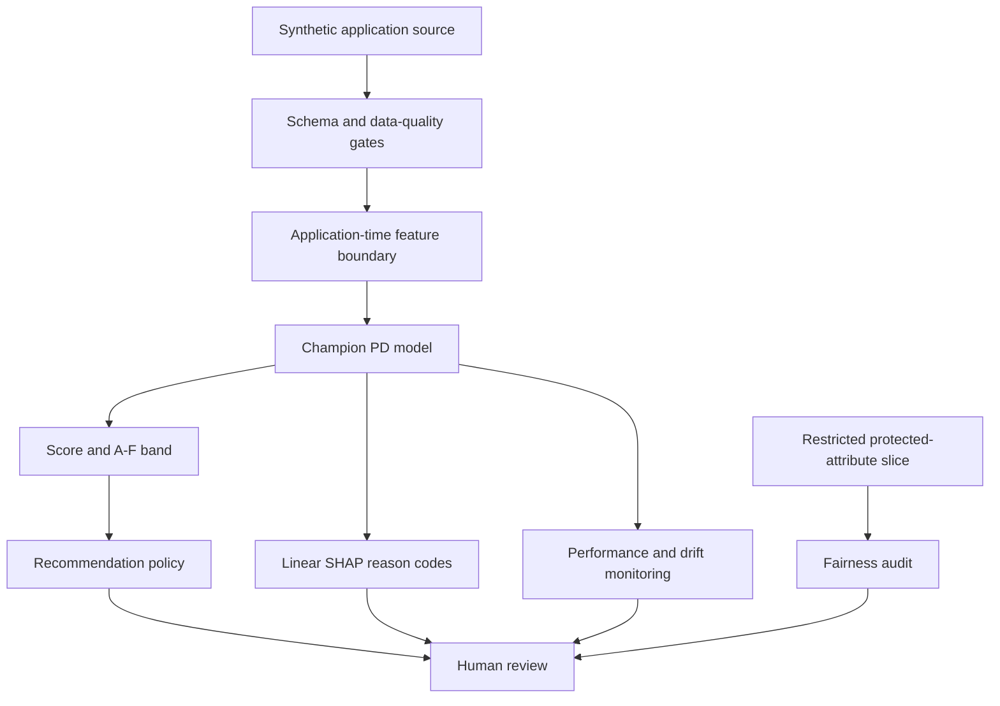
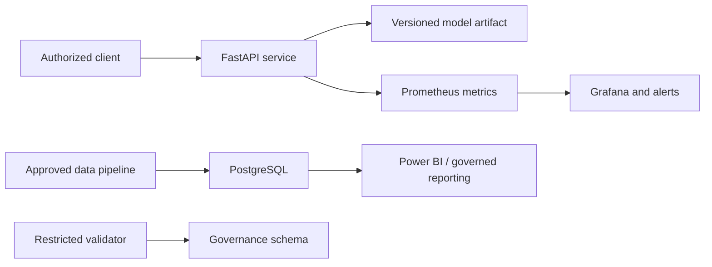

# System architecture

## Design objective

The platform keeps estimation, policy and final authority separate. A model estimates
12-month default probability; an explicit policy maps that estimate to a recommendation;
an authorized reviewer or approved downstream process owns the final action.

## Component responsibilities

| Layer | Implementation | Responsibility |
|---|---|---|
| Data | `credit_risk.data` | Deterministic generation, temporal dates and canonical hash |
| Validation | `credit_risk.validation` | Schema, uniqueness, target, completeness and safety controls |
| Modeling | `credit_risk.modeling` | Champion and challenger training, temporal validation gates |
| Metrics | `credit_risk.metrics` | Discrimination, calibration and decile evidence |
| Explainability | `credit_risk.explainability` | Exact additive Linear SHAP and reviewer reason codes |
| Policy | `credit_risk.policy` | Score, band, recommendation and illustrative expected loss |
| Fairness | `credit_risk.fairness` | Disaggregated allocation and predictive-performance review |
| Monitoring | `credit_risk.monitoring` | Monthly performance, PSI and alert disposition |
| Service | `credit_risk.service` / `api` | Artifact-backed recommendation API |
| Data serving | PostgreSQL / Power BI / Excel | Decision intelligence and governance evidence |
| Operations | Docker / Kubernetes / Prometheus | Hardened runtime and service observability |

## Trust boundaries

1. **Source boundary:** only schema-valid application-time fields pass to preprocessing.
2. **Protected-data boundary:** gender and age band remain in a restricted audit slice.
3. **Model boundary:** a versioned artifact produces PD only.
4. **Policy boundary:** thresholds are separately owned and configurable.
5. **Action boundary:** no model method sends a message, transfers funds or records a final
   lending decision.
6. **Evidence boundary:** model, policy, explanation and human rationale require independent
   audit records in a production design.

## Deployment topology

The committed Kubernetes manifests are references. They intentionally contain a placeholder
image name and no secret material.
