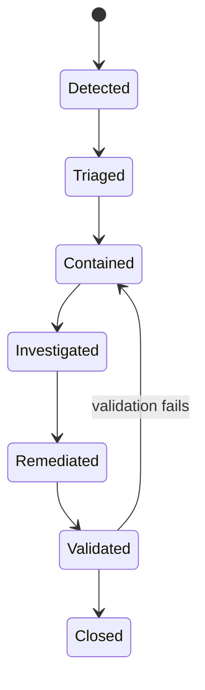

# Model incident response

## Severity

| Severity | Example | Initial response |
|---|---|---|
| SEV-1 | Incorrect decisions at scale, protected-data exposure, model artifact compromise | Stop or isolate affected use; executive and legal escalation |
| SEV-2 | Red performance/drift signal, unavailable manual fallback, material reason-code error | Restrict use; model-risk investigation |
| SEV-3 | Amber drift, localized data-quality issue, non-material latency | Investigate within normal on-call process |

## Required evidence

- Incident ID and timeline
- Detection source
- Affected model and policy versions
- Input cohorts and estimated impact
- Human actions and overrides
- Data, code and deployment changes
- Containment, remediation and validation evidence
- Approval to resume

## Response sequence

## Post-incident review

Update the risk register, monitoring thresholds, test suite, training material and governance
decision. Do not close the incident solely because a service restarted.
